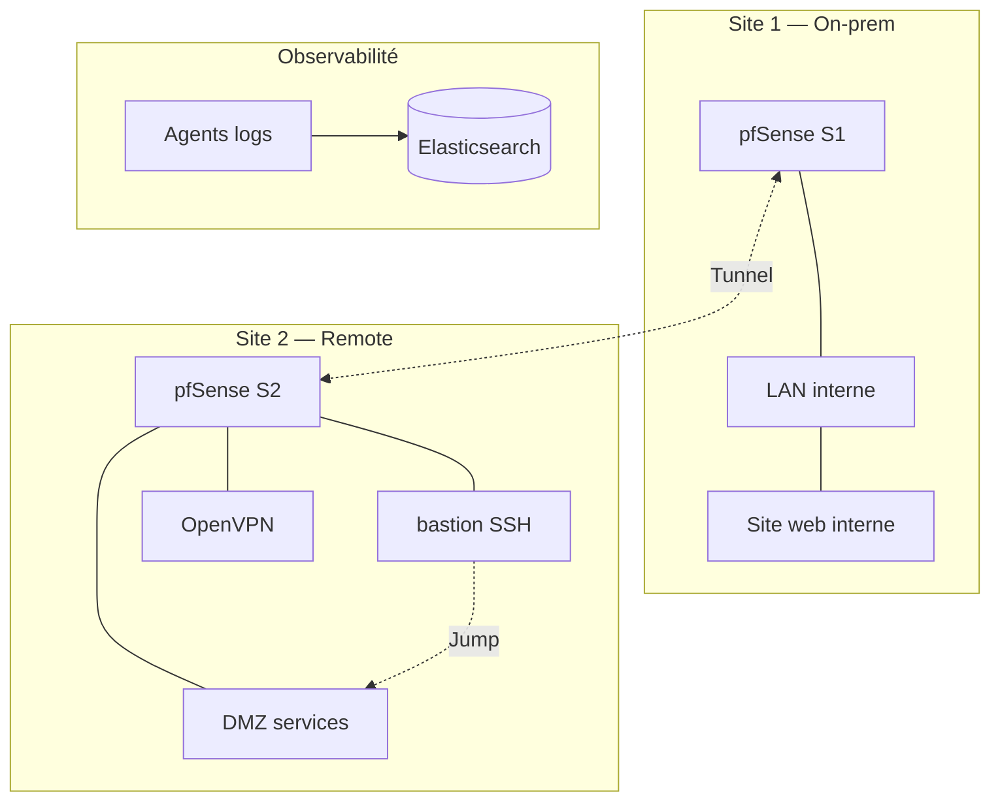

# Architecture — Hybrid Cloud CIA (two Proxmox sites)

Ce document doit être présent lors des revues avec un **diagramme exporté** (PNG/SVG depuis Draw.io, Excalidraw, etc.). Les valeurs ci-dessous sont des **placeholders** : remplacez par votre plan IP réel.

## Sites

| Site | Rôle | Proxmox / edge | VMs (max 3) |
|------|------|----------------|-------------|
| **S1 — On‑prem** | Principal, utilisateurs LAN, NetBox Elastic possibles… | À compléter | VM1 pfSense ?, VM2 services ?, VM3 … |
| **S2 — Remote** | Accès Internet, bastion, terminaison VPN | À compléter | VM1 pfSense ?, VM2 bastion ?, VM3 … |

## Segmentation réseau

Visez au minimum **LAN / DMZ / Admin** (ou équivalent documenté).

- **LAN** utilisateurs / services internes
- **DMZ** (services exposés indirectement ou inter-sites)
- **Admin** (gestion Proxmox, consoles IPAM GUI, bastion depuis Internet avec moindre privilège)

## Schéma logique (Mermaid — exporter aussi en image pour la soutenance)

## Points de contrôle (pare-feu)

Pour chaque flux : **source**, **destination**, **port**, **action**, **justification**.

| Flux | Règle (résumé) |
|------|----------------|
| Internet → S2 | Uniquement OpenVPN + bastion SSH (ports documentés) |
| VPN → LAN autorisées | Préfixes S1 ⇄ S2 uniquement |

## VPN (OpenVPN)

- Terminaison sur : pfSense (package OpenVPN), VM Debian, ou autre (à préciser)
- Protocole / port serveur-client **identiques** (UDP 1194 fréquent)
- Routage : préfixes LAN documentés dans `architecture` et poussés côté OpenVPN

## Bastion

- Exemple : `ssh -J bastion@IP_PUBLIQUE utilisateur@hôte_interne`
- Logs vers Elastic

## DNS forwarding

- Décrire : qui résout quelles zones pour le site distant, via quel forwarder traversant le tunnel.

## IPAM NetBox

- Instance documentée hors secrets ; synchronisation playbook dans `configs/netbox/`.

## Observabilité

- Placement cluster Elasticsearch ; collectors (Filebeat, Metricbeat) par VM critique.
