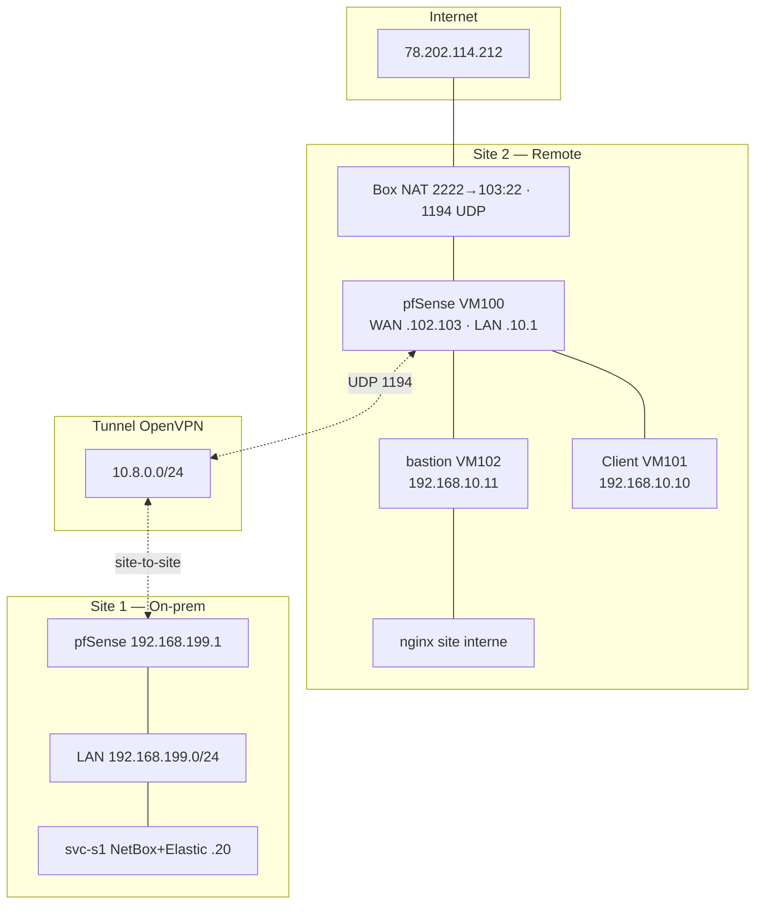

# Architecture — Hybrid Cloud CIA (deux sites Proxmox)

Document de référence pour la soutenance.

- Diagramme PNG : [`architecture-diagram.png`](./architecture-diagram.png)
- Source Mermaid : [`architecture-diagram.mmd`](./architecture-diagram.mmd)

## Vue d’ensemble

| Site | Rôle | État labo |
|------|------|-----------|
| **S1 — On‑prem** | Site principal, NetBox, Elastic, pfSense | **Documenté** — déploiement via [`deploy-lab.md`](./deploy-lab.md) |
| **S2 — Remote** | Site distant Internet, pfSense, bastion, VPN, clients LAN | **Déployé** (Proxmox `Proxmox-01`) |

## Site 2 — Remote (détail opérationnel)

| VM ID | Nom | Rôle | IP / interface |
|-------|-----|------|----------------|
| 100 | FW | pfSense | WAN `192.168.102.103` · LAN `192.168.10.1/24` |
| 101 | Client | Windows (poste interne) | `192.168.10.10` |
| 102 | bastion-s2 | Ubuntu, nginx (site interne démo), SSH | `192.168.10.11` |

**Accès opérateur**

| Usage | Adresse |
|-------|---------|
| IP publique box | `78.202.114.212` |
| OpenVPN (UDP) | `78.202.114.212:1194` |
| SSH bastion (via NAT box) | `ssh -p 2222 bastion@78.202.114.212` |
| SSH bastion (via VPN → WAN pfSense) | `ssh bastion@192.168.102.103` |
| Proxmox (VPN requis) | `https://192.168.102.11:8006` |
| GUI pfSense (LAN/VPN) | `https://192.168.10.1` |

**Segmentation S2**

- **WAN** : interface vers box / Internet (`192.168.102.0/24` côté uplink)
- **LAN** : `192.168.10.0/24` — clients + bastion + services internes
- **VPN tunnel** : `10.8.0.0/24` (OpenVPN, serveur typ. `10.8.0.1`)

## Site 1 — On‑prem (3 VMs max)

Routage VPN observé : `Client (10.8.0.x) → 10.8.0.1 → 192.168.199.131 → 192.168.102.11`

| VM | Nom | Rôle | IP |
|----|-----|------|-----|
| — | Proxmox S1 | Hyperviseur | `192.168.199.131` |
| 1 | fw-s1 | pfSense | `192.168.199.1` (LAN) |
| 2 | svc-s1 | NetBox + Elastic (Docker) | `192.168.199.20` |
| 3 | web-s1 | Site interne S1 (optionnel) | `192.168.199.30` |

**Services centralisés (svc-s1)**

| Service | URL |
|---------|-----|
| NetBox | `http://192.168.199.20:8080` |
| Elasticsearch | `http://192.168.199.20:9200` |
| Kibana | `http://192.168.199.20:5601` |

Déploiement : `ansible-playbook playbooks/deploy-site1.yml` (voir [`deploy-lab.md`](./deploy-lab.md)).

## Schéma logique

## Points de contrôle pare-feu (S2 — résumé)

Voir [`../configs/pfsense/site2-wan-rules.md`](../configs/pfsense/site2-wan-rules.md).

| Flux | Port | Action | Justification |
|------|------|--------|---------------|
| Internet → WAN | UDP 1194 | Autoriser | OpenVPN site-à-site |
| Internet → WAN | TCP 22 | Refuser (WAN direct) | SSH non exposé sur 22 public |
| Box → WAN | TCP 2222 → 103:22 → 10.11:22 | Autoriser | Bastion administré |
| Internet → WAN | TCP 80/443 | Refuser | Pas d’exposition web directe |
| VPN → LAN S2 | RFC1918 S2 | Autoriser | Administration post-tunnel |
| LAN → Internet | Étatful | Autoriser | Sortie utilisateurs |

## DNS (S2)

| Type | Nom | Cible |
|------|-----|-------|
| Host override | `client1.site2.local` | `192.168.10.10` |
| Domain override | `site2.local` | forwarder `192.168.10.1` |

Test : `nslookup client1.site2.local 192.168.10.1` depuis le bastion.

## Bastion

- Compte dédié `bastion` (pas root direct depuis Internet).
- Accès externe : **uniquement** via NAT contrôlé (port 2222) ou VPN puis SSH WAN/LAN documenté.
- Saut vers VM interne : `ssh -J bastion@78.202.114.212:2222 user@192.168.10.10` (si SSH actif sur cible).

## Site web interne

- Service : **nginx** sur `192.168.10.11` (VM bastion).
- Accessible depuis LAN S2 et depuis VPN ; **non** joignable en HTTP direct sur IP publique (preuve `curl` timeout).

## IPAM NetBox

- Instance : **svc-s1** `192.168.199.20:8080`
- Données : `configs/netbox/sites-prefixes.example.yml`
- Sync : `configs/netbox/scripts/sync_from_inventory.py` + playbook `netbox-sync.yml`

## Observabilité

- Stack : Docker sur **svc-s1** (`iac/docker/elastic/`)
- Collecte : rôle Ansible `filebeat` sur bastion S2 → Elastic S1
- Guide Kibana : `configs/elastic/kibana-guide.md`
- Playbook : `playbooks/deploy-observability.yml`

## Évolutivité

Convention d’adressage pour un **site N** :

- LAN site N : `192.168.(10+N).0/24`
- pfSense LAN : `.1`
- Bastion : `.11`
- Premier client : `.10`

Documenter chaque nouveau site dans NetBox avant déploiement playbook.
